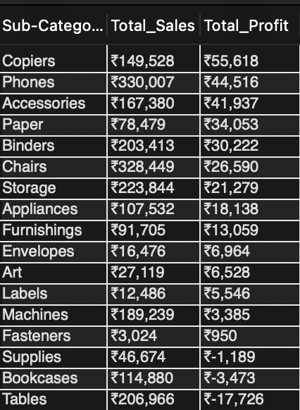

# Superstore Sales Analysis: A Data-Driven Journey in SQL

### Why I Chose This Project
As a business analytics student, I'm fascinated by how data can solve real-world problems. I chose this project to move beyond theory and get my hands dirty answering a classic business question: **What really drives profit in a business, and how can we find opportunities to improve?**

My goal was to act as a business analyst for a fictional Superstore, using their sales data to uncover insights that could lead to smarter, more profitable decisions.

---
### Approach
My approach was to start broad and then drill down into the details. Using **MySQL Workbench**, I navigated the data by asking a series of questions, starting with the big picture and moving to more specific operational details. The entire analysis was conducted using SQL, focusing on everything from basic aggregations to more advanced window functions.

---
### Key Insights
The data told a fascinating story with several key takeaways:

* **The Unprofitable Best-Seller:** My first big surprise was discovering that the **'Tables'** sub-category, despite being a high-sales item, was actually losing the company money. This was a powerful reminder that revenue doesn't always equal profit.

* **The High-Risk Customers:** By analyzing customer segments and geography, it became clear that the business has specific weak spots. Several states, like **Texas and Ohio**, were significant loss centers, suggesting a need for a regional strategy review.

* **The Danger of Discounts:** My analysis showed a clear tipping point. Discounts of 20% or less were fine, but once they exceeded 30%, the **average profit per order turned negative**. This revealed how a poorly managed discount strategy can quickly erase margins.

* **The Seasonal Surge:** By looking at performance over time, I confirmed a strong seasonal trend. The business consistently sees its highest sales and profits in the last quarter of the year (Sept-Dec), which has major implications for inventory and marketing.

---
### From Analysis to Action: My Recommendations 
Data is only useful if it leads to action. Based on my findings, my strategic recommendations for the Superstore would be:

1.  **Re-evaluate the "Tables" Strategy:** Immediately investigate the pricing and costs associated with the 'Tables' sub-category. We need to turn this popular but unprofitable product line around.

2.  **Implement a Smart Discount Policy:** Cap standard discounts at a profitable level (e.g., 25%) and create a specific approval process for any higher discounts, especially in already unprofitable states.

3.  **Capitalize on Seasonal Peaks:** Align inventory and marketing budgets with the predictable Q4 surge. Plan major campaigns and ensure stock levels are highest from September to December to maximize revenue during the peak season.

---
### What I Learned
This project was a fantastic learning experience. I strengthened my advanced SQL skills, particularly with CTEs and window functions. More importantly, I practiced the core business analyst skill of translating complex query results into a clear, actionable business strategy.

All SQL scripts used for this analysis are available in the `sql_scripts/` folder.
